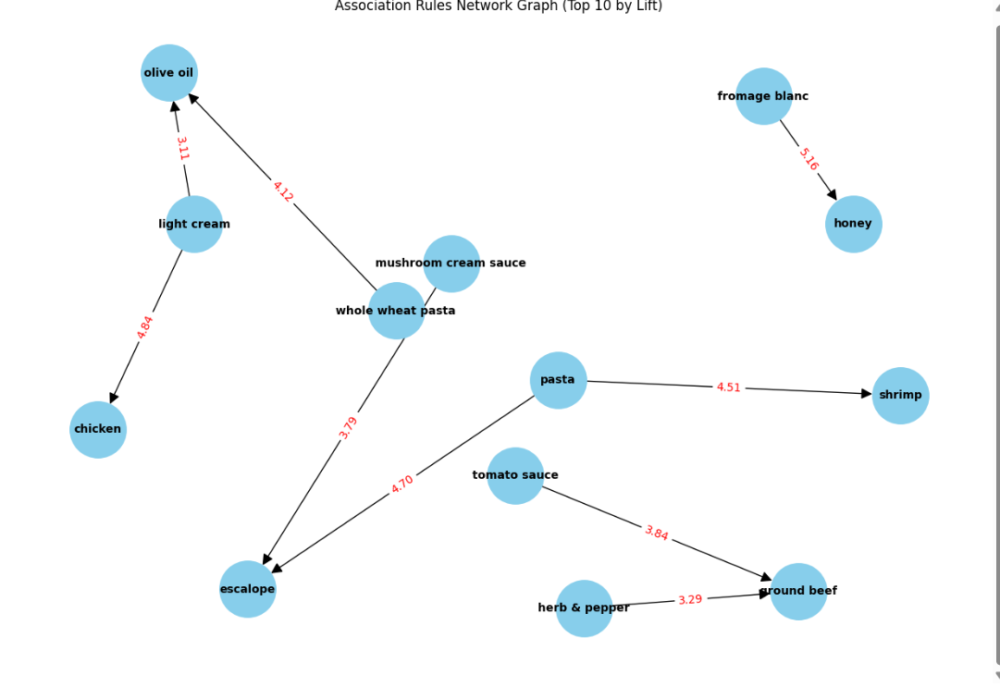

# Market Basket Optimization with Apriori

This project performs Market Basket Analysis on a grocery store's transaction data to discover association rules between products. The goal is to identify which items are frequently purchased together.

The [Apriori algorithm](#the-apriori-algorithm) is used to find these rules, which are then evaluated using the key metrics of **Support**, **Confidence**, and **Lift**.

---

## Dataset

* **File:** `Market_Basket_Optimisation.csv`
* **Description:** This dataset contains 7,501 unique transactions from a French grocery store. Each row represents a single transaction, and the columns list the items purchased in that transaction.

---

##  Concepts Demonstrated

* **Association Rule Learning:** A rule-based machine learning method for discovering interesting relations between variables in large datasets.
* **Apriori Algorithm:** A classic algorithm used for mining frequent itemsets and generating association rules.
* **Support:** The percentage of total transactions that contain a specific itemset.
* **Confidence:** The likelihood that a rule (e.g., {A} -> {B}) is true.
* **Lift:** The measure of how much more likely two items are to be bought together than by random chance. This is the key metric for finding valuable, non-obvious associations.

---

##  Requirements

This project requires Python 3 and the following libraries:
* `pandas`
* `numpy`
* `matplotlib`
* `seaborn`
* `apyori`
* `networkx`

The main library, `apyori`, can be installed via pip:
```bash
pip install apyori



## Analysis of Top 10 Rules by Lift

**This table shows the Top 10 strongest and most actionable association rules found in the dataset, sorted by "Lift." A high Lift (anything > 1) indicates a strong positive correlation, meaning the items are bought together far more often than by random chance.**

### Here are the key insights from the top 3 rules:

**Rule 1 (Row 3): {fromage blanc} -> {honey}**
* This is the strongest association in the entire dataset, with a **Lift of 5.16**.
* **Insight:** A customer who buys `fromage blanc` is **5.16 times more likely** to also buy `honey` than a random customer.
* **Metrics:** While the **Support is very low (0.33%)**, meaning this specific combination is rare, the **Confidence is 24.5%**. This tells us that when this rare purchase *does* happen, the rule holds true about 1 out of 4 times.

**Rule 2 (Row 0): {light cream} -> {chicken}**
* This is the second-strongest rule, with a **Lift of 4.84**.
* **Insight:** A customer buying `light cream` is **4.84 times more likely** to also buy `chicken`. This is another non-obvious pairing that could be used for promotions.
* **Metrics:** This combination is also rare (**Support = 0.45%**), but has a **Confidence of 29%**, making it a fairly reliable rule when the "if" condition (buying `light cream`) is met.

**Rule 3 (Row 2): {pasta} -> {escalope}**
* This rule has a very high **Lift of 4.70**.
* **Insight:** This is a classic recipe-based pairing. Customers buying `pasta` are **4.7 times more likely** to buy `escalope` (a thin slice of meat).
* **Metrics:** This rule is more reliable all-around. It has the highest **Confidence (37.2%)** and **Support (0.58%)** of the top 3, meaning it not only has a strong association but also happens more frequently.

**Overall Conclusion:**

All of the top 10 rules show a Lift value greater than 3.1, which confirms they are all statistically significant, positive correlations. These rules provide excellent, data-driven opportunities for cross-selling, such as creating targeted "bundle" promotions or strategically placing these items near each other in a store.